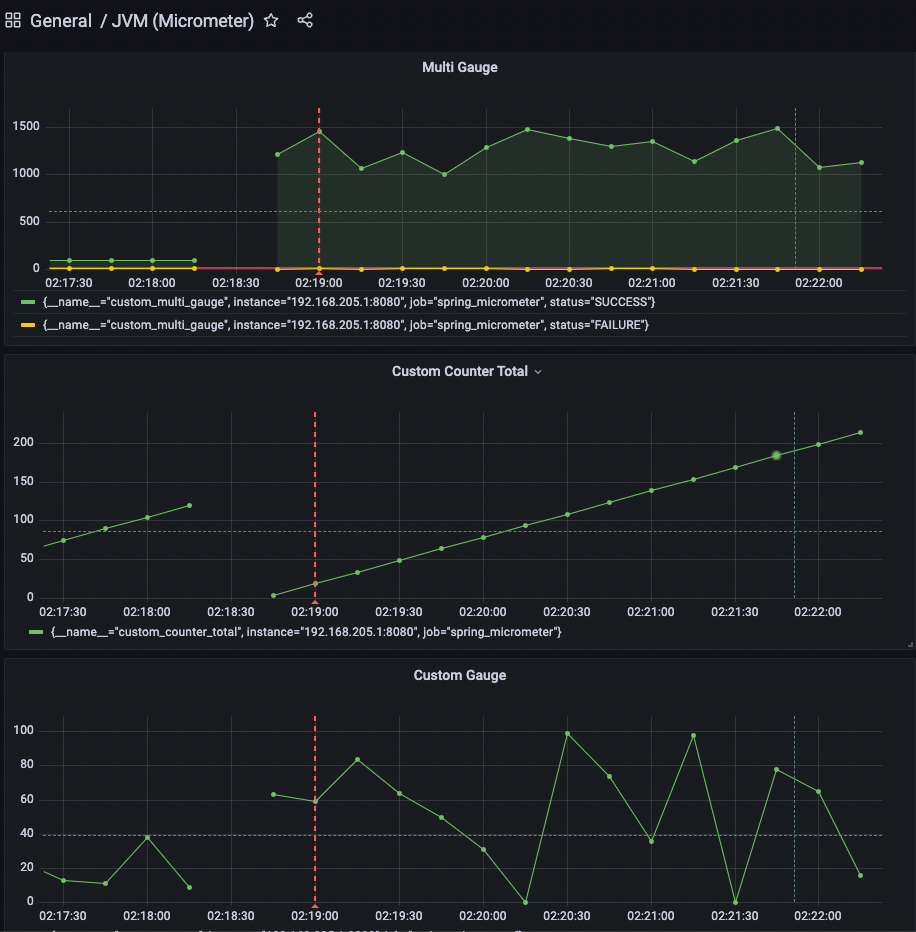

### 실행 방법
```shell
# 선행과정
# 1.ifconfig (or ipconfig) 로 docker bridge network 의 IP 확인
# 2.jib/prometheus/prometheus.yml 에서 target 에 1번 IP 복사
 
cd jib
docker-compose up
```
```shell
# Prometheus 접근
http://localhost:9090

# Prometheus 메트릭 확인
curl -X GET "http://localhost:8080/actuator/prometheus"

# Grafana 접근
# ID/PW : admin/admin
http://localhost:3000 
```

### TBU
gauge 는 수동으로 증가시키지 않는다. 변경이 감지되었을 메트릭을 쏜다.


### Refernce
**Counter vs. gauge, summary vs. histogram** : https://prometheus.io/docs/practices/instrumentation/#counter-vs-gauge-summary-vs-histogram

https://autsoft.net/defining-custom-metrics-in-a-spring-boot-application-using-micrometer/

https://fabianlee.org/2022/06/29/java-adding-custom-metrics-to-spring-boot-micrometer-prometheus-endpoint/
